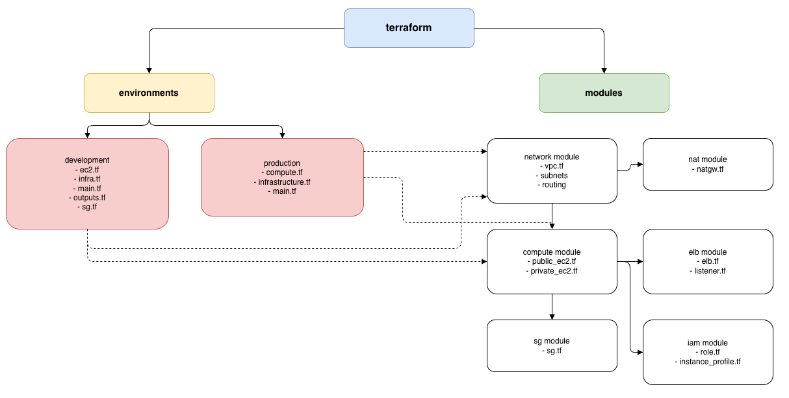

[](https://aws.amazon.com/)
[](https://www.terraform.io/) []()
[]() []() []()

# Production Terraform Deployment Modules
 
> **Overview** : Production Grade Terraform Deployment Modules across 2 envs : **Development** and **Production**

<br/>

<details>
<summary>🗺️ <b>Architecture Overview</b> <kbd><b>(👆🖱️ click to Show/Hide)<b/></kbd></summary>
<br/>



 <details>
  <summary>🗺️ <b> Diagram using [Mermaid ](https://mermaid.ai/open-source/intro) </b> <kbd><b>(👆🖱️ click to Show/Hide)<b/></kbd></summary>
  <br/>

  ```mermaid
  flowchart TD
  
      %% Root
      A["terraform"]
  
      %% Environments
      subgraph ENV["environments"]
          direction LR
          D["development<br/>- ec2.tf<br/>- infra.tf<br/>- main.tf<br/>- outputs.tf<br/>- sg.tf"]
          E["production<br/>- compute.tf<br/>- infrastructure.tf<br/>- main.tf"]
      end
  
      %% Modules
      subgraph MOD["modules"]
          direction TB
  
          F["network module<br/>- vpc.tf<br/>- subnets<br/>- routing"]
          G["nat module<br/>- natgw.tf"]
          H["compute module<br/>- public_ec2.tf<br/>- private_ec2.tf"]
          I["elb module<br/>- elb.tf<br/>- listener.tf"]
          J["sg module<br/>- sg.tf"]
          K["iam module<br/>- role.tf<br/>- instance_profile.tf"]
      end
  
      %% Top-level links
      A --> ENV
      A --> MOD
  
      %% Module relationships
      F --> G
      F --> H
      H --> I
      H --> J
      H --> K
  
      %% Cross references (dashed)
      E -.-> F
      E -.-> H
      D -.-> H
  
      %% Optional layout tweaks
      linkStyle 6,7,8 stroke-dasharray: 5 5
  
      %% Styling
      style A fill:#cfe2ff,stroke:#6c8ebf,stroke-width:2px
  
      style ENV fill:#fff2cc,stroke:#d6b656,stroke-width:2px
      style MOD fill:#d9ead3,stroke:#82b366,stroke-width:2px
  
      style D fill:#f4cccc,stroke:#cc0000,stroke-width:1.5px
      style E fill:#f4cccc,stroke:#cc0000,stroke-width:1.5px
  
      style F fill:#eeeeee,stroke:#999999
      style G fill:#eeeeee,stroke:#999999
      style H fill:#eeeeee,stroke:#999999
      style I fill:#eeeeee,stroke:#999999
      style J fill:#eeeeee,stroke:#999999
      style K fill:#eeeeee,stroke:#999999
  ```

 </details>
</details>


## 📌 **Table of Contents (TOC)**

| **📖 Documentation** | **🚀 Terraform envs** | **🔧 Modules & Resources** |
|---|---|---|
| **[📂 Structure](./docs/notes/structure.md)**<br><small>Project layout & organization</small> | **[🌱 Development](./terraform/envs/development)**<br><small>Dev VPC, EC2, ELB setup</small> | **[🌐 Network](./terraform/modules/network)**<br><small>VPC, subnets, routing</small> |
| **[🏃‍♂️ Setup](./docs/notes/setup.md)**<br><small>Prerequisites & quickstart</small> | **[🔥 Production](./terraform/envs/production)**<br><small>Prod infrastructure deploy</small> | **[💻 Compute](./terraform/modules/compute)**<br><small>Public/private EC2 instances</small> |
| **[🔧 Features](./docs/notes/features_stack.md)**<br><small>AWS services stack overview</small> | **[⚙️ tfvars Config Setup](./terraform/envs)**<br><small>Env variables setup [ (👀 template)](./terraform/envs/production/terraform.tfvars.example)</small> | **[⚖️ ELB](./terraform/modules/elb)**<br><small>Network Load Balancer + TGs</small> |
| **[📚 Glossary](./docs/notes/glossary.md)**<br><small>Key terms & definitions</small> | | **[🔐 IAM](./terraform/modules/iam)**<br><small>Roles & instance profiles</small> |

| **🛠️ Supporting Modules** | **📊 Assets & Diagrams** |
|---|---|
| **[🌉 NAT Gateway](./terraform/modules/nat)**<br><small>Private subnet internet access</small> | **[🏗️ Architecture](./docs/assets/diagrams/architecture-diagram.drawio.png)**<br><small>Visual infrastructure overview</small> |
| **[🛡️ Security Groups](./terraform/modules/sg)**<br><small>EC2/ELB firewall rules</small> | **[📸 Screenshots](./docs/assets/screenshots/)**<br><small>Console & deployment captures</small> |


<details>
<summary>🔘 Quick Navigation Mappings :<kbd><b>(👆🖱️ click to Show/Hide)<b/></kbd></summary>
<br/>

| Action / Button | Shortcut / Anchor Target  | Use Case |
|--------|----------|----------|
| ⌨️ Search page | <kbd>Win: Ctrl+F</kbd> / Mac: <kbd>⌘+F</kbd> | Find "Glossary" |
| 💻 Web | Browser "Find in page" | Find " Structure" |
| 📱 Mobile | Click/Tap links  | Find "Setup" |
| 📋 TOC | `#table-of-contents` | Current page 📌 TOC |
| 🏠 Home | `../../README.md#table-of-contents` | Project 📌 TOC |
| ⬇️ Bottom | `#end` | Jump to Page Footer |
| ⬆️ Top | `#top` | Jump to Page Header |

<div style="font-size: 0.85em; color: #666; margin-top: 0.5em;">
*Pro tip: Use <kbd>Tab</kbd> to cycle focus, <kbd>Esc</kbd> to close.*
</div>

</details>
